# License Plate Recognition

## Dataset

Ground truth data is generated by manually annotating our data.  
- 60% for training  
- 40% for evaluation  

The allocation of data into training and evaluation sets is done randomly, preserving the diversity and distribution of our dataset. Data is presented to the program as screenshots of the video instead of the video itself. Every plate is included once at max.

**Example annotation**

---

## License Plate Localization

### Color Segmentation
We used color segmentation to isolate the license plate based on its color characteristics. The first step is selecting the correct parameters for the right color. First we decided some values for hue, saturation and value for the general color of the plates. However, when we saw our evaluation result we under perform for our training data, we tweaked the values with the information we got from some images. Then with chosen parameters we mask our plate with the resulting color.

### Morphology
Then we use morphology to reduce noise and fill the holes on the pixel choosing the correct kernel for opening and closing. To optimize these operations, we select a right kernel shape and size for the plates. This allows us to prepare the image for further processing. By eliminating irrelevant noise, and closing gaps in regions, we make subsequent process more accurate. 

### Contour
After that, we use contour to fit the shape of the plate by taking into account of aspect ratio of plate, then with filtering with ratio, we selecting right location of the plate which is done by using bounding of the rectangle with taking top left corner and adding offset relative to that corner to get a coordinate of the pixels. By doing so we get a cropped plate.

**Resulting plate after filtering**

### Evaluation (Localization)
Our model has achieved the following accuracy in each given group. We used the IoU model for our evaluation and put a threshold of 0.5.
- Category 1: Training: 100.0% Evaluation: 90.3%  
- Category 2: Training: 33.3% Evaluation: 11.7%  
- Category 3: Training: 0.0% Evaluation: 0.0%  
- Category 4: Training: 0.0% Evaluation: 0.0%  

Our model performed well with Category 1 images. It wasn't as great with images from Category 2. However, this can be attributed to our frame selection from the data. We selected our data from the start with a 1 Hz frequency. This made it so that some of our data points in Category 2 corresponded to images where the plates are half cut off.

---

## License Plate Recognition

### 1. Resizing
To preserve the plate's aspect ratio and prevent distortion, the input image is resized based on its width. This ensures consistent character sizes during recognition.

### 2. Adaptive Thresholding
The resized image is converted to grayscale. After that based on image quality and color, we applied Adaptive thresholding to binarize the image. This method divides the image into smaller regions, calculating a local threshold for each region based on pixel properties.  
Adaptive thresholding handles varying lighting conditions by dynamically selecting the optimal block size (size of pixel blocks around each point) and constant (C) to adjust the threshold. These two parameters are chosen based on image color and resolution. This ensures accurate binarization for each type of plate.

**Thresholded example**

### 3. Dynamic Kernel
A 3x3 kernel is initially used for morphological operations.  
If the number of contours detected exceeds 100, the kernel size is incremented by 2. This step helps close gaps between characters, improving detection on plates with larger character spacing.  
A dilation operation is applied to enhance character connectivity.

### 4. Contour Detection
Contours are extracted from the thresholded image using `cv2.findContours()`.  
Bounding boxes are drawn around each detected contour.  
Contours are filtered based on:
- Min/Max height and width (for example ≥ 25% of the plate height)  
- Aspect ratio  
- Solidity (removing small blobs and noise)  

**Character crops (examples)**

  
  
  
  
  
  

### 5. Character Patch Extraction
Valid contours are cropped from the binarized image. Each character patch is resized to 32x32 pixels to maintain consistency during recognition.

### 6. Feature Extraction with SIFT
SIFT (Scale-Invariant Feature Transform) descriptors are extracted from each character patch.  
A grid of keypoints is created, spaced 4 pixels apart, to ensure consistent sampling across the patch.

### 7. Character Recognition
Character patches are compared with a reference database containing labeled character images (including rotated variations).  
A k-nearest neighbors (k=3) algorithm is used for classification.  
If the second-best match differs by more than 500, the top match is selected directly.

### 8. Sorting and Visualization
Recognized characters are sorted left to right based on their x-coordinates to ensure the correct order of the license plate. The detected characters are overlaid on the original image with bounding boxes, providing a visual representation of the results.

**Visualization**

### 9. Filtering Ambiguous Results
Plates with fewer than four valid characters or those with exclusively unrecognized characters ('?') are discarded to minimize false positives.

### Evaluation (Recognition)
We used accuracy (no of correct/ total no) for our evaluation.  

**Character recognition:**  
- Correct: Training: 81.5% Evaluation: 75.6%  
- Missed: Training: 16.1% Evaluation: 12.8%  
- False: Training: 2.4% Evaluation: 11.6%  

**Plate recognition (all characters correct):**  
- Total: Training: 65.0% Evaluation: 50.0%  
- Category 1: Training: 100% Evaluation: 100%  
- Category 2: Training: 66.6% Evaluation: 66.6%  
- Category 3: Training: 50.0% Evaluation: 0.0%  
- Category 4: Training: 20.0% Evaluation: 33.3%  

A big chunk of errors in plates stem from one missed or falsely recognized letter. Some misses are because plates are not recognized. Letter recognition on blue background gives worse results. The image quality also highly affects results.

---

## Handling Ambiguities
Our system can handle differentiating between similar-looking characters by leveraging the following strategies:  
1. Keypoint-Based Features with SIFT Descriptor Matching: The SIFT algorithm extracts robust features that uniquely represent characters. These features can capture specific details that distinguish "0" from "O" or "5" from "S".  
2. Euclidean Distance: The system computes the Euclidean distance between test descriptors and the reference database. The closest match determines the recognized character.  
3. Voting Mechanism (k-nearest) for Ambiguity: a voting system is applied when Euclidean difference is not high enough. This ensures that the most frequently occurring character is selected, reducing misclassifications.  
4. Reference Database: The reference database with accurately labeled examples of all characters ensures better recognition. Our system uses slight variations (rotated versions, low-quality versions) in character appearance to make distinctions.  

---

## Flowchart & Scene Transition
The system defines a new scene when a plate recognized significantly differs from the past detected plates in the scene.  
- **Levenshtein distance** is used to measure differences between plates from frame to frame.  
- Within a scene, majority voting is applied across frames. Plates that don’t fit the Dutch standard are filtered out before voting.  

> **This flowchart shows our pipeline end-to-end** (from annotation -> localization -> enhancement/segmentation -> recognition -> voting/validation -> output).

```mermaid
flowchart LR
    %% ---- STAGE 0: START / ANNOTATION ----
    A["Start"] --> B["Annotate"]
    B --> C["Localization of Plates"]

    %% ---- STAGE 1: LOCALIZATION (WHITE / YELLOW) ----
    C --> D["White Plate Algorithm"]
    C --> E["Yellow Plate Algorithm"]
    D --> F["Evaluate"]
    E --> F

    %% ---- STAGE 2: PRE-PROCESS / CROPPING ----
    F --> G["Edge Detection"]
    G --> H["Cropped Plates Segmenation"]
    H --> I["Pre Process Plates"]

    %% ---- STAGE 3: QUALITY-DEPENDENT ENHANCEMENT ----
    I --> J{"Is the image quality sufficient?"}
    J -- "Yes" --> K["Default Plates Enchanment"]
    J -- "No"  --> L["Low Quality Plates Enchanment"]
    K --> M["Contours"]
    L --> M
    M --> N["Color Mask"]

    %% ---- STAGE 4: CHARACTER RECOGNITION PATH ----
    N --> O["Compare With Reference Characters"]
    O --> P{"Is at least 6 characters recognized?"}
    P -- "No"  --> Q["Ignore"]
    P -- "Yes" --> R["Add to Recognized Plates Array"]

    %% ---- STAGE 5: STANDARDIZATION & VALIDITY ----
    R --> S["Standardize Plate"]
    S --> T["Add Relavent Dash (-)"]
    T --> U["Check Validty"]

    %% ---- STAGE 6: DETECTION / FILTERING ----
    U --> V["Detect the transition"]
    V --> W["Filter out non-valid plates"]
    W --> X{"Is detected?"}
    X -- "No"  --> Q
    X -- "Yes" --> Y["SIFT Descriptor"]
    Y --> Y2["Keypoints"]
    Y2 --> Z["Custom DB"]
    Z --> Z2["Evaluate"]
    Z2 --> AA["Return the Plate"]
```

## User Interface

The system also includes a **graphical user interface** (GUI) that allows us to visualize the results of the pipeline in real time.  
Through the interface, a user can:

- Load input frames(video screenshots).  
- Display the **localized plate** with bounding boxes.  
- Show the **thresholded image** used for segmentation.  
- Present the **recognized plate string** after voting and validation.  

This makes it easier to debug each stage of the pipeline (localization, segmentation, recognition) and to evaluate the system visually.

*User interface for plate detection and recognition.*

---
## Integrated System Evaluation
- Category 1: 100%  
- Category 2: 60%  
- Category 3: 30%  
- Category 4: 0%  

- System performs as expected on Category 1. In Category 2, the non-cut nature of the video causes errors. In Category 3, multiple plates and lower resolution reduce accuracy. Category 4 was not prioritized.  
---

## Weaknesses of the Current System
- Limited International Plate Support: Designed mainly for Dutch plates.  
- Color Segmentation Constraints: Focuses currently on yellow and white plates; plates with other colors like blue, green, or custom shades are not adequately segmented.  

---

## Future Directions
- Improve International Plate Support: expand the reference database with samples from various regions, covering diverse fonts, layouts, and colors.  
- Improve Color Segmentation: apply different segmentation algorithms for different plate colors.  
- Use of Deep Learning: supplement SIFT-based recognition with deep learning models, which can be more robust to layout variations.

---
## Tech
- Python
- OpenCV
